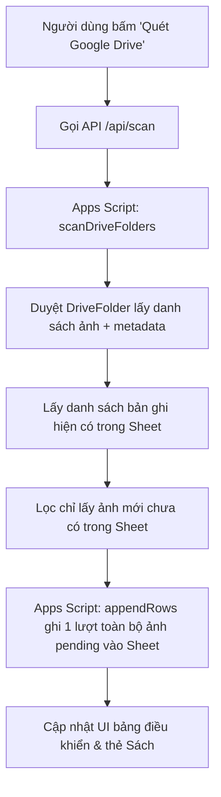
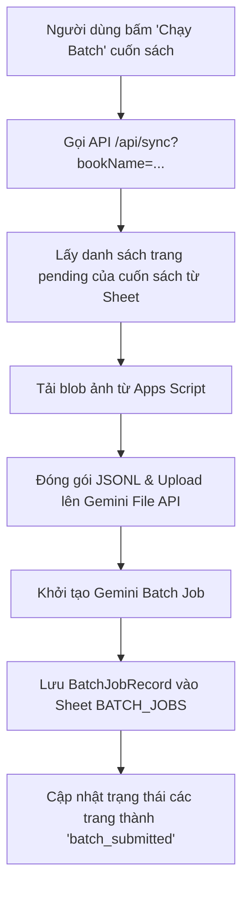
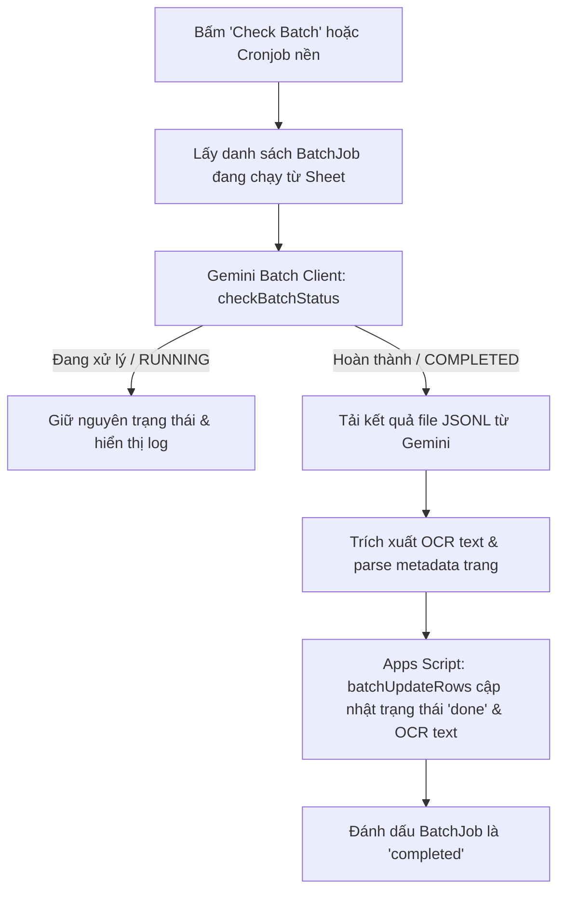

# PDF & Ebook OCR — Tự Động Hoá Nhận Diện Sách Scan Tiếng Việt

Ứng dụng tự động hoá nhận diện văn bản (OCR) cho sách và tài liệu scan tiếng Việt từ **Google Drive**, xử lý qua **Google Gemini Vision API** (hỗ trợ cả chế độ xử lý tức thì và **Gemini Batch API giảm 50% chi phí**), quản lý tiến độ trực quan qua **Google Sheets** và tự động xuất các trang sách ra file nén **ZIP Markdown** (`page1.md`, `page2.md`... theo từng cuốn sách).

---

## 🌟 Tính Năng Chính

- **Quản lý theo từng cuốn sách**: Mỗi thư mục con trên Google Drive được nhận diện là một cuốn sách riêng biệt, có tiến độ và thống kê riêng (`Tổng số trang`, `Đã xong`, `Đang xử lý`, `Lỗi`).
- **Tách biệt Quét & Thực thi OCR**: Khi quét Google Drive, ứng dụng chỉ nạp danh sách ảnh vào Google Sheet ở trạng thái Chờ (`pending`). Bạn hoàn toàn chủ động quyết định khi nào chạy OCR cho từng cuốn.
- **Tiết kiệm 50% chi phí với Gemini Batch API**: Tự động gom toàn bộ trang của cuốn sách gửi lên hệ thống Batch của Google AI và định kỳ kiểm tra nạp kết quả về Sheet.
- **Tùy chỉnh Prompt OCR trực tiếp**: Cho phép chỉnh sửa quy tắc trích xuất văn bản tiếng Việt ngay trên giao diện web (giữ nguyên chính tả, từ ngữ nguyên văn, định dạng Markdown).
- **Xuất ZIP Markdown phân cấp**: Tải nhanh file `.zip` chứa các trang văn bản Markdown được đánh số thứ tự chuẩn xác cho từng cuốn hoặc toàn bộ thư mục.
- **Giao diện Web trực quan**: Theo dõi tiến độ thời gian thực, xem trước ảnh gốc kèm kết quả OCR, quản lý và xóa sách đã hoàn thành.

---

## 🚀 Hướng Dẫn Cấu Hình Từng Bước

### Bước 1: Chuẩn bị Thư mục trên Google Drive

Tạo một thư mục gốc trên Google Drive (ví dụ: `OCR_Books`), bên trong chứa các thư mục con tương ứng với từng cuốn sách:

```text
📁 THƯ MỤC GỐC (DRIVE_FOLDER_ID)
 ├── 📁 Cuon_Sach_1/
 │    ├── 001.jpg
 │    ├── 002.jpg
 │    └── 003.jpg
 └── 📁 Cuon_Sach_2/
      ├── page_01.png
      └── page_02.png
```

> 💡 **Lấy ID thư mục gốc**: Mở thư mục gốc trên trình duyệt, sao chép chuỗi ký tự ở cuối đường link URL:  
> `https://drive.google.com/drive/folders/`**`1a2b3c4d5e6f7g8h9i0jKLMNOP`**

---

### Bước 2: Thiết lập Google Apps Script & Google Sheet

Ứng dụng kết nối an toàn với Google Drive / Sheets qua một Apps Script Web App mà **không cần Google Cloud Service Account phức tạp**:

1. Mở một file [Google Sheets mới](https://sheets.new).
2. Trên thanh menu, chọn **Tiện ích mở rộng (Extensions)** > **Apps Script**.
3. Xóa nội dung mặc định, mở file [`apps-script/Code.gs`](apps-script/Code.gs) trong dự án này, sao chép toàn bộ nội dung và dán vào.
4. Thiết lập mật mã bảo mật (**Secret Token**):
   - Bấm vào biểu tượng **Cài đặt dự án (Project Settings ⚙️)** ở menu bên trái.
   - Cuộn xuống mục **Thuộc tính tập lệnh (Script Properties)** > Bấm **Thêm thuộc tính tập lệnh**:
     - **Thuộc tính (Property)**: `SECRET_TOKEN`
     - **Giá trị (Value)**: Nhập một mật mã bí mật bất kỳ do bạn tự đặt (ví dụ: `my-secret-token-2026`).
   - Bấm **Lưu thuộc tính tập lệnh**.
5. Triển khai Web App:
   - Bấm nút **Triển khai (Deploy)** ở góc trên bên phải > chọn **Tùy chọn triển khai mới (New deployment)**.
   - Chọn loại: **Ứng dụng web (Web app)**.
   - **Thực thi dưới dạng (Execute as)**: `Tôi (Me)`
   - **Ai có quyền truy cập (Who has access)**: `Bất kỳ ai (Anyone)`
   - Bấm **Triển khai (Deploy)** > Chọn **Cấp quyền truy cập (Authorize access)** và đăng nhập tài khoản Google của bạn.
   - Sao chép **URL ứng dụng web** (dạng `https://script.google.com/macros/s/.../exec`).

---

### Bước 3: Cấu hình Biến môi trường (`.env`)

Tạo file `.env` tại thư mục gốc của dự án (sao chép từ `.env.example`):

```dotenv
# 1. Apps Script Bridge
APPSCRIPT_WEB_APP_URL=https://script.google.com/macros/s/AKfycb.../exec
APPSCRIPT_SECRET=my-secret-token-2026

# 2. ID Thư mục gốc trên Google Drive
DRIVE_FOLDER_ID=1a2b3c4d5e6f7g8h9i0jKLMNOP

# 3. Gemini API Key (Lấy tại https://aistudio.google.com/apikey)
GEMINI_API_KEY=AIzaSy...
GEMINI_MODEL=gemini-3.6-flash

# 4. Cấu hình Batch API (tiết kiệm 50% chi phí)
USE_BATCH_MODE=true
BATCH_POLL_INTERVAL_MINUTES=20
BATCH_MAX_IMAGES_PER_JOB=300
```

---

## 💻 Hướng Dẫn Khởi Chạy

### Cách 1: Chạy bằng Docker (Khuyên dùng)

```bash
docker compose up -d --build
```

Truy cập giao diện tại: **`http://localhost:3000`**

### Cách 2: Chạy trực tiếp bằng Node.js / pnpm

```bash
pnpm install
pnpm run dev
```

Truy cập giao diện tại: **`http://localhost:5173`**

---

## 🔄 Kiến Trúc Luồng Xử Lý (System Flow Architecture)

### 1. Luồng Quét Google Drive (`/api/scan`)



### 2. Luồng Xử Lý Batch OCR (`/api/sync` hoặc Chạy Batch từng cuốn)



### 3. Luồng Kiểm Tra & Nạp Kết Quả Batch (`Check Batch`)



---

## 📊 Trạng Thái Hệ Thống

- **Cập nhật lần cuối**: 2026-09-22 16:25
- **Đã hoàn thành**:
  - Sửa lỗi tích hợp **Gemini Batch API (400 FAILED_PRECONDITION)**:
    - Đặt đúng MIME type `application/jsonl` (`Content-Type` và `X-Goog-Upload-Header-Content-Type`) khi tải file JSONL lên Gemini Files API (thay vì `text/plain`).
    - Bổ sung cơ chế tự động kiểm tra và chờ trạng thái `state: ACTIVE` của file upload trước khi gọi `batchGenerateContent`.
    - Tự động rollback các dòng `batching` về `pending` khi submit thất bại để người dùng có thể thử lại ngay mà không bị kẹt.
    - Bổ sung rich logging an toàn (che API key) in đầy đủ metadata khi submit batch thất bại.
  - Toàn bộ pipeline kiểm định: format, lint, type check, unit tests (24/24 passed), knip, graphify.
- **Đang dở**: Không có.
- **Nợ kỹ thuật / Cần lưu ý**:
  - Khi triển khai Google Apps Script mới, cần deploy phiên bản mới (New deployment) để đồng bộ hàm `appendRows`.

---

## 📜 Changelog

### 2026-09-22 (Sửa lỗi Gemini Batch API 400 FAILED_PRECONDITION & Kiểm tra File Metadata)

- **Thêm/sửa**:
  - Sửa `Content-Type` và `X-Goog-Upload-Header-Content-Type` thành `application/jsonl` trong [`src/lib/server/geminiBatchClient.ts`](src/lib/server/geminiBatchClient.ts).
  - Thêm phương thức `getFileMetadata(fileName)` và vòng lặp chờ trạng thái `state === 'ACTIVE'` trước khi tạo batch job.
  - Cải thiện rollback trạng thái hàng Google Sheet từ `batching` về `pending` trong [`src/lib/server/batchRunManager.ts`](src/lib/server/batchRunManager.ts) khi gặp lỗi submit batch.
  - Bổ sung log chẩn đoán chi tiết che giấu API key khi gọi batch thất bại.
  - Cập nhật test cases trong [`tests/geminiBatchClient.test.ts`](tests/geminiBatchClient.test.ts) và [`tests/batchRunManager.test.ts`](tests/batchRunManager.test.ts) (24/24 passed).
- **Kết quả pipeline**: format ✅ | lint ✅ | type ✅ | test ✅ (24/24 pass) | knip ✅ | graphify ✅ (284 nodes, 18 communities, 0 import cycles).
- **File chính bị ảnh hưởng**: [`src/lib/server/geminiBatchClient.ts`](src/lib/server/geminiBatchClient.ts), [`src/lib/server/batchRunManager.ts`](src/lib/server/batchRunManager.ts), [`tests/geminiBatchClient.test.ts`](tests/geminiBatchClient.test.ts), [`README.md`](README.md).

### 2026-09-22 (Cập nhật Model sang gemini-3.6-flash theo chuẩn Google AI)

- **Thêm/sửa**:
  - Chuyển đổi model mặc định sang **`gemini-3.6-flash`** (thay thế model cũ không còn cấp phép cho người dùng mới).
  - Cập nhật danh sách model Flash khả dụng: `gemini-3.6-flash`, `gemini-3.8-flash`, `gemini-3.6-flash-lite`.
  - Cập nhật toàn bộ cấu hình mẫu trong `.env.example`, `README.md` và các test suites (24/24 pass).
- **Kết quả pipeline**: format ✅ | lint ✅ | type ✅ | test ✅ (24/24 pass) | knip ✅ | graphify ✅ (284 nodes, 18 communities, 0 import cycles).
- **File chính bị ảnh hưởng**: [`src/lib/server/config.ts`](src/lib/server/config.ts), [`src/lib/server/geminiClient.ts`](src/lib/server/geminiClient.ts), [`src/lib/server/orchestrator.ts`](src/lib/server/orchestrator.ts), [`src/routes/+page.svelte`](src/routes/+page.svelte), [`.env.example`](.env.example), [`README.md`](README.md).

### 2026-09-22 (Sửa lỗi Gemini Batch API endpoint & payload format)

- **Thêm/sửa**:
  - Sửa lỗi `404 Method not found` khi khởi tạo Batch Job trong [`src/lib/server/geminiBatchClient.ts`](src/lib/server/geminiBatchClient.ts).
  - Cập nhật endpoint chính xác: `${baseUrl}/v1beta/${normalizedModel}:batchGenerateContent?key=${apiKey}`.
  - Cập nhật payload chính xác: `{ batch: { display_name, input_config: { file_name } } }`.
  - Cập nhật model mặc định từ unverified sang model hiện hành `gemini-2.5-flash` và tối ưu cơ chế test connection trực tiếp.
  - Cải thiện thông báo lỗi khi tạo batch để in toàn bộ response body lỗi từ Google AI.
  - Bổ sung và cập nhật unit tests trong [`tests/geminiBatchClient.test.ts`](tests/geminiBatchClient.test.ts) (24/24 tests pass).
- **Kết quả pipeline**: format ✅ | lint ✅ | type ✅ | test ✅ (24/24 pass) | knip ✅ | graphify ✅ (284 nodes, 18 communities, 0 import cycles).
- **File chính bị ảnh hưởng**: [`src/lib/server/geminiBatchClient.ts`](src/lib/server/geminiBatchClient.ts), [`src/lib/server/config.ts`](src/lib/server/config.ts), [`src/lib/server/geminiClient.ts`](src/lib/server/geminiClient.ts), [`src/lib/server/orchestrator.ts`](src/lib/server/orchestrator.ts), [`tests/geminiBatchClient.test.ts`](tests/geminiBatchClient.test.ts), [`tests/geminiPrompt.test.ts`](tests/geminiPrompt.test.ts), [`tests/config.test.ts`](tests/config.test.ts), [`tests/syncService.test.ts`](tests/syncService.test.ts), [`.env.example`](.env.example), [`README.md`](README.md).

### 2026-09-22 (Chuẩn hóa Lucide Icons & Loại bỏ cảnh báo Deprecated)

- **Thêm/sửa**:
  - Rà soát và thay thế toàn bộ các Lucide icons cũ/deprecated trên toàn bộ project sang chuẩn Lucide v1+:
    - `CheckCircle2` ➔ `CircleCheck`
    - `AlertCircle` ➔ `CircleAlert`
    - `AlertTriangle` ➔ `TriangleAlert`
    - `XCircle` ➔ `CircleX`
    - `Loader2` ➔ `LoaderCircle`
  - Đảm bảo 100% sạch cảnh báo build / lint.
- **Kết quả pipeline**: format ✅ | lint ✅ | type ✅ | test ✅ (23/23 pass) | knip ✅ | graphify ✅ (284 nodes, 18 communities, 0 import cycles).
- **File chính bị ảnh hưởng**: [`src/lib/components/StatsCards.svelte`](src/lib/components/StatsCards.svelte), [`src/lib/components/BatchJobsTable.svelte`](src/lib/components/BatchJobsTable.svelte), [`src/lib/components/SetupStatusCard.svelte`](src/lib/components/SetupStatusCard.svelte), [`src/lib/components/BooksOverviewCard.svelte`](src/lib/components/BooksOverviewCard.svelte), [`src/lib/components/FileTable.svelte`](src/lib/components/FileTable.svelte), [`src/lib/components/CustomDialogModal.svelte`](src/lib/components/CustomDialogModal.svelte), [`src/lib/components/OcrPreviewModal.svelte`](src/lib/components/OcrPreviewModal.svelte), [`src/lib/components/SyncActionPanel.svelte`](src/lib/components/SyncActionPanel.svelte).

### 2026-09-22 (Bổ sung Asynchronous Batch Execution & Real-time Progress Tracking)

- **Thêm/sửa**:
  - Tái cấu trúc luồng `POST /api/books/[bookName]` thành bất đồng bộ (Async Job Runner với `BatchRunManager`).
  - Thêm Type `BatchRun` & `BatchRunPhase` tại [`src/lib/types/batchRun.ts`](src/lib/types/batchRun.ts).
  - Tối ưu hóa tải ảnh đa luồng song song (Concurrency pool 4) trong `batchRunManager.ts`.
  - Bổ sung REST APIs: `GET /api/batch-runs` và `GET /api/batch-runs/[runId]`.
  - Nâng cấp UI [`src/lib/components/BooksOverviewCard.svelte`](src/lib/components/BooksOverviewCard.svelte) hiển thị thanh tiến trình nhảy số và phần trăm thời gian thực.
  - Thêm unit test cho `BatchRunManager` nâng tổng số test lên 23 tests (100% pass).
- **Kết quả pipeline**: format ✅ | lint ✅ | type ✅ | test ✅ (23/23 pass) | knip ✅ | graphify ✅ (284 nodes, 18 communities, 0 import cycles).
- **File chính bị ảnh hưởng**: [`src/lib/types/batchRun.ts`](src/lib/types/batchRun.ts), [`src/lib/server/batchRunManager.ts`](src/lib/server/batchRunManager.ts), [`src/routes/api/batch-runs/+server.ts`](src/routes/api/batch-runs/+server.ts), [`src/routes/api/batch-runs/[runId]/+server.ts`](src/routes/api/batch-runs/[runId]/+server.ts), [`src/routes/api/books/[bookName]/+server.ts`](src/routes/api/books/[bookName]/+server.ts), [`src/lib/components/BooksOverviewCard.svelte`](src/lib/components/BooksOverviewCard.svelte), [`src/routes/+page.svelte`](src/routes/+page.svelte), [`tests/batchRunManager.test.ts`](tests/batchRunManager.test.ts).

### 2026-09-22

- **Thêm/sửa**:
  - Cập nhật toàn bộ tài liệu kiến trúc, diagrams hệ thống, quy trình luồng quét - batch - sync - export.
  - Bổ sung tài liệu chuẩn hóa `AI_WORKFLOW.md`, `README.md` (Trạng thái hệ thống & Changelog).
  - Tối ưu hóa UI render hàng trăm trang bằng chunked infinite scroll (20 trang/chunk) + instant search.
  - Tối ưu Apps Script với API `appendRows` bulk insert.
- **Kết quả pipeline**: format ✅ | lint ✅ | type ✅ | test ✅ (21/21 pass) | knip ✅ | graphify ✅ (292 nodes, 20 communities, 0 import cycles).
- **File chính bị ảnh hưởng**: [`apps-script/Code.gs`](apps-script/Code.gs), [`src/lib/components/FileTable.svelte`](src/lib/components/FileTable.svelte), [`src/lib/components/CustomDialogModal.svelte`](src/lib/components/CustomDialogModal.svelte), [`README.md`](README.md), [`AI_WORKFLOW.md`](AI_WORKFLOW.md).
